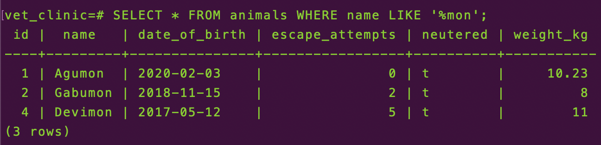
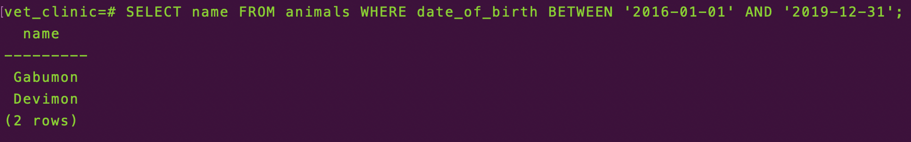
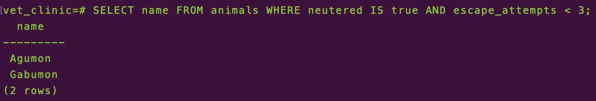
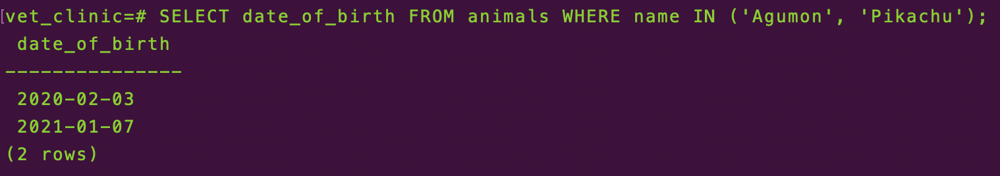
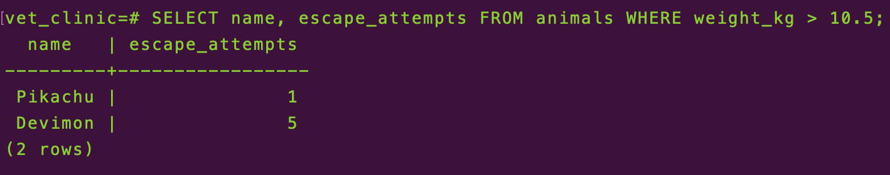
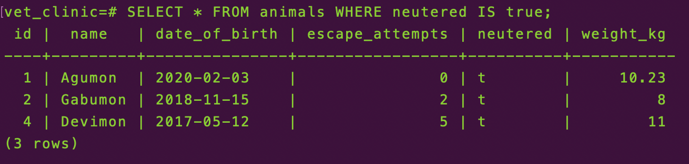
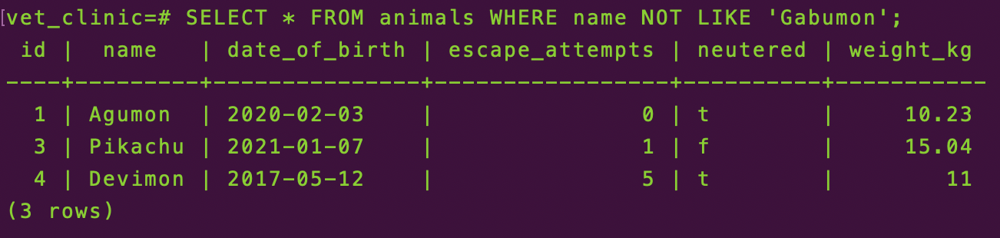
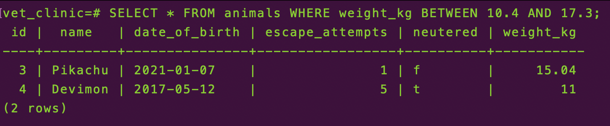

<div align="center">
  <h1><b>vet-clinic-database</b></h1>
  <h3>Example queries:</h3>
  
  
  
  
  
  
  
  
  <br />
</div>

## Getting Started

This repository includes files with plain SQL that can be used to recreate a database:

- Use [schema.sql](./schema.sql) to create all tables.
- Use [data.sql](./data.sql) to populate tables with sample data.
- Check [queries.sql](./queries.sql) for examples of queries that can be run on a newly created database. **Important note: this file might include queries that make changes in the database (e.g., remove records). Use them responsibly!**

<a name="readme-top"></a>

<!-- TABLE OF CONTENTS -->

# 📗 Table of Contents

- [📗 Table of Contents](#-table-of-contents)
- [📖 \[vet-clinic-database\] ](#-vet-clinic-database-)
  - [🛠 Built With ](#-built-with-)
    - [Tech Stack ](#tech-stack-)
    - [Key Features ](#key-features-)
  - [💻 Getting Started ](#-getting-started-)
    - [Prerequisites](#prerequisites)
    - [Setup](#setup)
    - [Install](#install)
    - [Usage](#usage)
  - [👥 Author ](#-author-)
  - [🔭 Future Features ](#-future-features-)
  - [🤝 Contributing ](#-contributing-)
  - [⭐️ Show your support ](#️-show-your-support-)
  - [🙏 Acknowledgments ](#-acknowledgments-)
  - [❓ FAQ (OPTIONAL) ](#-faq-optional-)
  - [📝 License ](#-license-)

<!-- PROJECT DESCRIPTION -->

# 📖 [vet-clinic-database] <a name="vet-clinic-database"></a>

**[vet-clinic-database]** is a relational database for a vet clinic.

## 🛠 Built With <a name="built-with"></a>

### Tech Stack <a name="tech-stack"></a>

<details>
<summary>Database</summary>
  <ul>
    <li><a href="https://www.postgresql.org/">PostgreSQL</a></li>
  </ul>
</details>

<!-- Features -->

### Key Features <a name="key-features"></a>

- **[Database schema to keep the structure of entire database]**
- **[Populate database with sample data]**
- **[Queries that provide answers to the questions from all projects]**

<p align="right">(<a href="#readme-top">back to top</a>)</p>

<!-- GETTING STARTED -->

## 💻 Getting Started <a name="getting-started"></a>

To get a local copy up and running, follow these steps.

### Prerequisites

In order to run this project you need:

- PostgreSQL

### Setup

Clone this repository to your desired folder:

```sh
  cd my-folder
  git clone git@github.com:dennis-every/vet-clinic-database.git
```

### Install

Install this project with:

```sh
  cd my-project
  psql
  CREATE TABLE vet_clinic;
  /c vet_clinic;
  CREATE TABLE animals (
    id              INT GENERATED ALWAYS AS IDENTITY,
    name            VARCHAR(250),
    date_of_birth   DATE,
    escape_attempts INT,
    neutered        BOOLEAN,
    weight_kg       DECIMAL,
    PRIMARY KEY(id)
);
```

### Usage

To run the project, execute the following command:

```sh
  psql vet_clinic
```

<!-- AUTHOR -->

## 👥 Author <a name="author"></a>

👤 **Dennis Every**

- GitHub: [@dennis-every](https://github.com/dennis-every)

<p align="right">(<a href="#readme-top">back to top</a>)</p>

<!-- FUTURE FEATURES -->

## 🔭 Future Features <a name="future-features"></a>

- Project 2: query and update animals table.
- Project 3: query multiple tables.
- Project 4: add "join table" for visits.
- Project 5: database performance audit.
- Exercise: add database schema diagram.

<p align="right">(<a href="#readme-top">back to top</a>)</p>

<!-- CONTRIBUTING -->

## 🤝 Contributing <a name="contributing"></a>

Contributions, issues, and feature requests are welcome!

Feel free to check the [issues page](../../issues/).

<p align="right">(<a href="#readme-top">back to top</a>)</p>

<!-- SUPPORT -->

## ⭐️ Show your support <a name="support"></a>

If you like this project feel free to fork it and use it as you need.

<p align="right">(<a href="#readme-top">back to top</a>)</p>

<!-- ACKNOWLEDGEMENTS -->

## 🙏 Acknowledgments <a name="acknowledgements"></a>

I would like to thank Microverse for the information provided to build this project.

<p align="right">(<a href="#readme-top">back to top</a>)</p>

<!-- FAQ (optional) -->

## ❓ FAQ (OPTIONAL) <a name="faq"></a>

- **Can I use the project for any purpose?**

  - Yes, you can use this files for anything you need

- **Do I need to ask for permission?**

  - No need to ask for permission.

<p align="right">(<a href="#readme-top">back to top</a>)</p>

<!-- LICENSE -->

## 📝 License <a name="license"></a>

This project is [MIT](./MIT.md) licensed

<p align="right">(<a href="#readme-top">back to top</a>)</p>
